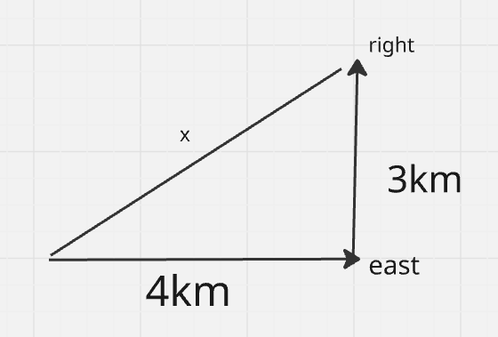
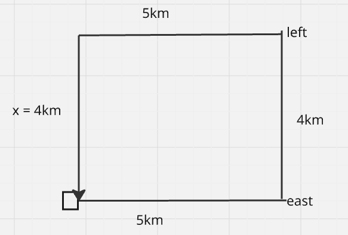
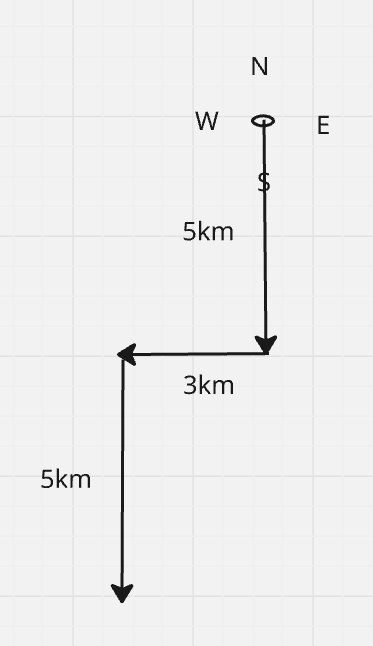

# QUESTIONS ON DIRECTION SENSES 

`ques` suresh starting from his house, goes 4km in the east, then he turns to his right and goes 3km. what minimum distance will be covered by him to come back to his house?


```
h^2 = b^2 + p^2
h^2 = 4^2 + 3^2
h^2 = 16 + 9
h = √25
h = 5km is the minimum distance hee needs to cover to reach the home back
```

---

`ques` siva starting from his house, goes 5 km in east and then he turns to his left and goes 4km. finally he turns to his left and goes 5km, now how far is he from his house and in what direction



```
ans = 4km in north direction
```

---

`ques` one morning after sunrise Juhi while going to school met lalli at prabhat road crossing. lalli's shadow was exactly to the right of juhi. if they were face to face, which direction was juhi facing?

```
south

as at the time of sunrise the sun is at the east and juhi right will be the west direciton and the face or juhi will point out to south
```

---

`ques` Y is in east of X which is in the north of Z. if P is in the south of Z, then in which direction of Y, is P?

```
SOUTH
```

---

`ques` if south-east becomes North, North-east becomes west and so-on. what will west become?


```
south east
```

---

`ques` a man walks 5 km toward south and then to the right. after walking 3km he turns to the left and walks 5 km. now in which direction is he from the starting place?



```
SOUTH-WEST
```

---

`ques` rahul put his time piece on the table in such a way that at 6 p.m. hour hand points to north. in which direction the minute hand will point at 9:15 p.m.?

```
west 
```

---

`ques` bismita walks 200m towards the east and then turns right and walks 210m to reach a hospital. what is the shortest distance between the starting point and the hospital?

```
290m
```

---

`ques` a person starts from point Z and moves 7km towards the south. he turns right and moves 5km, turns right and moves 3km, then turns right and move 1km. he takes a left turn and moves 4km to reach point X. how much and in which direction does he need to move now to reach point Z?

```
4km east
```

---

`ques` a boy walks 15m north, turns right, and walks 20m. again, he turns right and walks 15m. finally, he turns to his left and moves 20m. what is the distance now from his original position?

```
40m east
```

---

`ques` manoj starts from pont A and drives X km towards the south and then turns left and drives Y km. he then takes a right turn and drives fro 4km to reach point D. if manoj drove a total of 17km between points A and D, and both X and Y are the perfect squares where X > Y then what is the value of X?

```
9km = X
4km = Y
```

---

`ques` starting from point A, an animal walked 15m towards the east. it took a left turn and walked 25m. then, it took a right turn and walked 10m. again it took a left turn and walked 15m. finally, it took a left turn and walked 25m. how far and in which direction is the animal now from the starting point A?

```
40m , north
```

---

`ques` starting from point X, a person walked 20m towards the south to reach point Y. from there, he took a left turn and walked 25m to reach point z. he then took a left turn and walked for another 20m to reach point P. what is the approximate shortest distance between teh points X and Z in which direction is the person's final position with respect to point X?

```
32m east
```

---

`ques` john, in the morning, started walking towards the north and then turned towards the opposite side of the sun. he then turns left again and stops. which direction is he facing now?

```
south
```

---

`ques` one morning, raju walked towards the sun. after some time, he turned left and again to his left. which direction is he facing?

```
west
```

---

`ques` neeraj starts walking from point M towards east direction to reach N, which is 25m east to M. he then takes a right turn and walks 30m to reach point O. from O, he takes left turn and walks 25m to point P, then again, he takes a left turn and walks 20m to point Q, form Q, he takes a left turn and walks 30 m to reach point R. he then takes a right turn and walks 15m to reach S and finally takes a left turn to reach point T, which is 20m away from S in which direction is point N with respect to point R?

```
north-east
```

---

`ques` neeraj starts walking from point M towards east direction to reach N, which is 25m east to M. he then takes a right turn and walks 30m to reach point O. from O, he takes left turn and walks 25m to point P, then again, he takes a left turn and walks 20m to point Q, form Q, he takes a left turn and walks 30 m to reach point R. he then takes a right turn and walks 15m to reach S and finally takes a left turn to reach point T, which is 20m away from S. four of the following five belongs to a group based on their directions find the one that does not belong to that group?

```
```

---

`ques` neeraj starts walking from point M towards east direction to reach N, which is 25m east to M. he then takes a right turn and walks 30m to reach point O. from O, he takes left turn and walks 25m to point P, then again, he takes a left turn and walks 20m to point Q, form Q, he takes a left turn and walks 30 m to reach point R. he then takes a right turn and walks 15m to reach S and finally takes a left turn to reach point T, which is 20m away from S. how far is point M from point T?

```
5m
```

---

`ques` tom walked 10m towards north then turned right and walked 25m. then he turned right and walked 30 m , now he turned left and walked 10m. finally, he turned left and walked 20m. how far and in which direction is he from the starting point?

```
50m east
```

---

`ques` peter is facing north. he turns to his right and walks 20m and then turns to his left and walks 25m. he then walks 25m to his right. next, he walks 50, to his right. finally, he turns to his right and walks 30m. in which direction is he from the starting point?

```
west
```

---

`ques` manoj covered a distance of 50m towards the north. he then turned to his left and walked 20m. he again turned left and walkes 60m. finally, he turned to his right at an angle of 45 degree. in which direction is he moving finally?

```
south-west
```

---

`ques` tom left for his office in his car. he travelled 5km towards the north and then 10km towards the east. he then travelled 3km towards the south. further, he turned to the west and travelled 2km. finally, he turned towards the south and travelled 2km. how far and in which direction is he from the starting point?

```
8km east
```

---